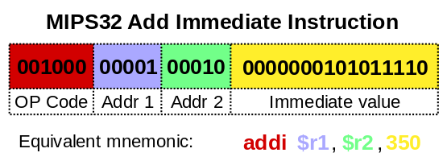
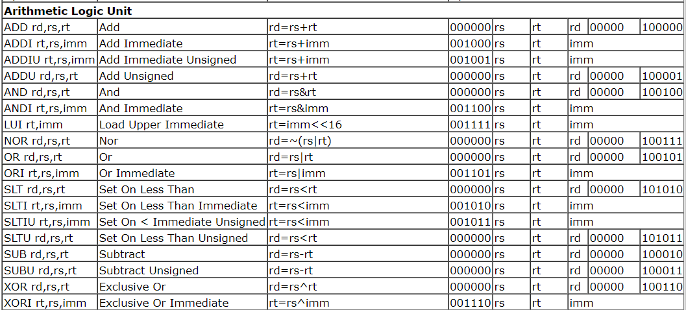
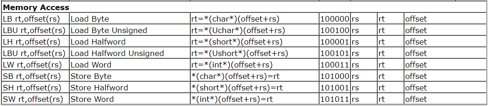
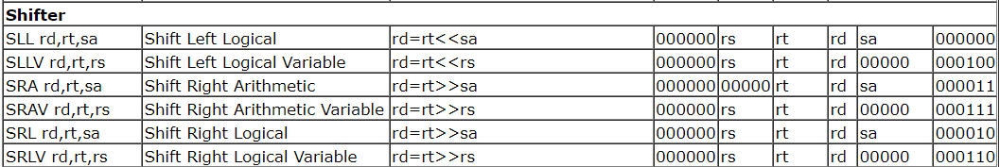
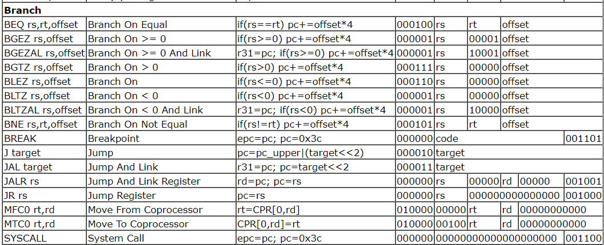
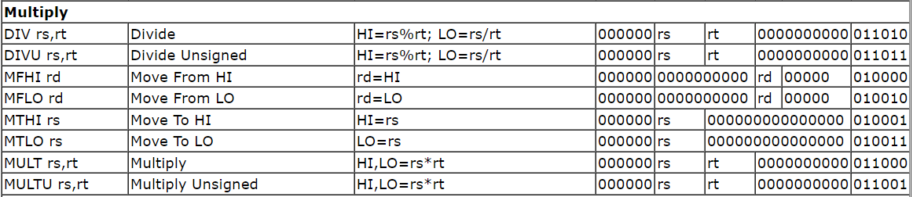

# PSX JavaScript Emulator

## Installation

### Install Node.js dependencies

```npm i```

### Run dev-server

```npm start```

## Running game (FAR FROM RUNNING GAMES)

Download PSX BIOS (512K image) and upload it using the web form. It is
persisted in IndexedDB, so on the next visit the emulator boots
automatically. Kernel TTY output (BIOS boot messages) is printed on the
page.

## Architecture

```
src/
  memory/     - memory bus: RAM/BIOS/scratchpad with pre-created views,
                region mirroring, IRQ controller, I/O dispatch to devices,
                code-page tracking for the block cache
  cpu/cpu.js  - R3000A interpreter: full opcode set, exceptions,
                load/branch delay slots. Allocation-free hot path.
  cpu/compiler.js - basic-block compiler: translates MIPS basic blocks
                into JS functions (new Function), caches them by virtual PC
                and invalidates on writes to RAM pages containing code.
                V8 then JIT-compiles hot blocks to machine code.
  cpu/gte.js  - GTE (COP2) geometry coprocessor: perspective transforms,
                lighting, color ops with hardware UNR division and flags
  gpu/        - GP0/GP1 command processor + software rasterizer (flat/
                gouraud/textured polygons, rects, lines, fills, VRAM
                transfers, semi-transparency, mask bits), 15/24bpp display
  dma/        - 7-channel DMA: GPU block + linked list, CDROM, SPU, OTC,
                DICR completion IRQs
  timers/     - three root counters (sysclock/dotclock/hblank sources)
  cdrom/      - command/interrupt state machine, BIN (2352) and ISO (2048)
                disc images, sector delivery via data fifo and DMA3
  joypad/     - SIO0 with a digital pad on keyboard input
  spu/        - register-level SPU (state round-trips, sound RAM
                transfers); audio is NOT synthesized yet
  psx.js      - machine wiring + scanline loop: CPU, device events and
                timers advance per line, VBlank at line 240
```

Execution model: each frame runs 263 scanlines; per line the `BlockCache`
executes ~2146 CPU cycles, delayed device events (CDROM responses, pad
acks) tick, and timers advance. The block dispatcher looks the current PC
up in the cache, compiles a new block when needed and falls back to the
interpreter for exotic cases (unaligned PC, GTE ops, branch in a delay
slot). Interpreter and compiled blocks are interchangeable mid-flight -
the differential test suite asserts identical architectural state on both
paths.

Ballpark on Node 22 (see `tests/bench.test.js`): interpreter ~90 Minstr/s,
block cache ~230 Minstr/s; the real console runs at ~33.9 Minstr/s.

The web form accepts a BIOS image (512K), a PS-X EXE (sideloaded once the
kernel boots) and BIN/ISO disc images. Discs fast-boot: the boot
executable is loaded straight from the image once the kernel is up,
which also bypasses the shell's license region lock (a Japanese disc
boots on an American BIOS). A retail SCPH-101 BIOS boots to the
interactive PSone menu; retail games (tested: Nekketsu Oyako) boot to
gameplay with pad input and SPU music.

Sound: 24 ADPCM voices with ADSR envelopes, noise, stereo mix at
44100Hz through WebAudio (browsers require one click/keypress before
audio starts).

Frontend: a Steam-style game library backed by a folder on disk (File
System Access API - pick the folder once, the handle persists in
IndexedDB). Subfolders/files with .bin/.iso images become cards, images
next to them become covers, click to play. Xbox (any "standard" layout)
controllers work through the Gamepad API alongside the keyboard, and
also navigate the library grid (d-pad/stick moves, A/Start launches).

Saves: slot 1 has an emulated memory card (full SIO0 sector protocol
with checksums and /ACK interrupts, pre-formatted). Writes persist to
IndexedDB automatically, so saves survive reloads. The BIOS memory-card
manager sees and manages it like a real card.

Timing note: the CPU counts 2 cycles per instruction (CPI=2), matching
the real R3000A's average memory-access cost. With 1 the guest runs
"too fast" relative to vblank and software-calibrated timeout loops
misfire - this plus flipping the GPUSTAT field bit at vblank END (not
together with the IRQ) is what fixed the shell's per-frame
"VSync: timeout" spam for real.

Known gaps: no reverb/pitch-modulation, no CDDA/XA audio streaming, no
MDEC (FMV decodes to garbage), no memory cards, simplified GTE corner
cases (intermediate overflow wrap), no dithering, no interlace
rendering.

## Development

If you want to commit to the repository, please run linter first (`npm run lint`) and cover code with tests (`npm test`).

### Memory map

Memory map: https://psx-spx.consoledev.net/memorymap/

| KUSEG (Virtual) | KSEG0 (Physical Mirror with Cache) | KSEG1 (Physical) | Memory size | Type                                                |
|-----------------|------------------------------------|------------------|-------------|-----------------------------------------------------|
| 00000000h       | 80000000h                          | A0000000h        | 2048K       | Main RAM (first 64K reserved for BIOS)              |          
| 1F000000h       | 9F000000h                          | BF000000h        | 8192K       | Expansion Region 1 (ROM/RAM)                        |
| 1F800000h       | 9F800000h                          | --               | 1K          | Scratchpad (D-Cache used as Fast RAM)               |
| 1F801000h       | 9F801000h                          | BF801000h        | 8K          | I/O Ports                                           |                                                    
| 1F802000h       | 9F802000h                          | BF802000h        | 8K          | Expansion Region 2 (I/O Ports)                      |       
| 1FA00000h       | 9FA00000h                          | BFA00000h        | 2048K       | Expansion Region 3 (SRAM BIOS region for DTL cards) | 
| 1FC00000h       | 9FC00000h                          | BFC00000h        | 512K        | BIOS ROM (Kernel) (4096K max)                       |


| KSEG2     | Size |                                                |
|-----------|------|------------------------------------------------|
| FFFE0000h | 0.5K | Internal CPU control regs (Cache Control) |


### CPU Registers

PSX uses 32bit wide regs, they are the following

| Name    | Alias  | Common Usage                                                                                   |
|---------|--------|------------------------------------------------------------------------------------------------|
| (R0)    | zero   | Constant (always 0) (this one isn't a real register)                                           |
| R1      | at     | Assembler temporary (destroyed by some pseudo opcodes!)                                        |
| R2-R3   | v0-v1  | Subroutine return values, may be changed by subroutines                                        |
| R4-R7   | a0-a3  | Subroutine arguments, may be changed by subroutines                                            |
| R8-R15  | t0-t7  | Temporaries, may be changed by subroutines                                                     |
| R16-R23 | s0-s7  | Static variables, must be saved by subs                                                        |
| R24-R25 | t8-t9  | Temporaries, may be changed by subroutines                                                     |
| R26-R27 | k0-k1  | Reserved for kernel (destroyed by some IRQ handlers!)                                          |
| R28     | gp     | Global pointer (rarely used)                                                                   |
| R29     | sp     | Stack pointer                                                                                  |
| R30     | fp(s8) | Frame Pointer, or 9th Static variable, must be saved                                           |
| R31     | ra     | Return address (used so by JAL,BLTZAL,BGEZAL opcodes), can be used as general purpose register |
| -       | pc     | Program counter                                                                                |
| -       | hi,lo  | Multiply/divide results, may be changed by subroutines                                         |


### MIPS Instructions



To read more go: https://en.wikipedia.org/wiki/Instruction_set_architecture
and
http://problemkaputt.de/psx-spx.htm#cpuspecifications

| Type | 	-31-                                format (bits)                                 -0- |               |         |                 |            |            |
|------|----------------------------------------------------------------------------------------|---------------|---------|-----------------|------------|------------|
| R	   | opcode (6)                                                                             | 	rs (5)       | 	rt (5) | 	rd (5)         | 	shamt (5) | 	funct (6) |
| I	   | opcode (6)                                                                             | 	rs (5)       | 	rt (5) | 	immediate (16) |
| J	   | opcode (6)                                                                             | 	address (26) |


#### Opcodes

The provided screenshots are valid for MIPS CPUs, 
but there **may be differences** with the actual PSX CPU, so be careful

##### ALU



##### Memory Access



#### Shifter



#### Branch



#### Multiply


