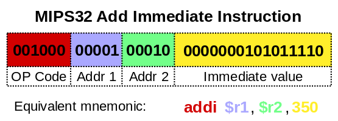
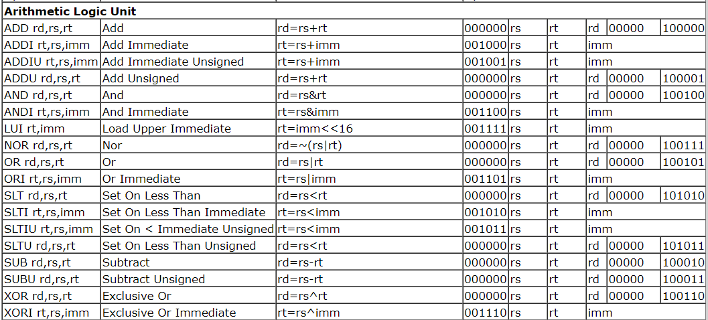
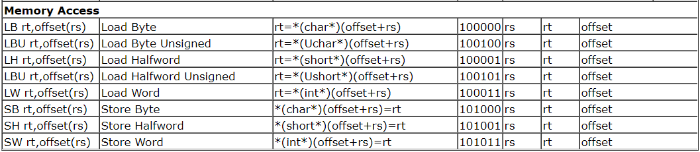
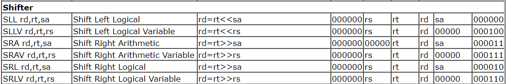
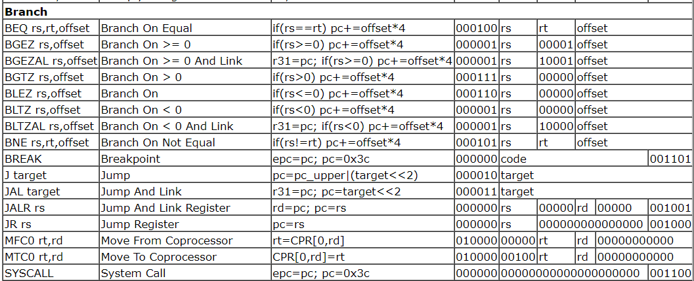
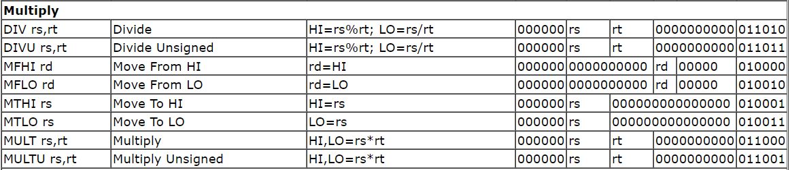

# PSX JavaScript Emulator

A PlayStation 1 (PSX) emulator written in pure JavaScript — no runtime
dependencies, runs in the browser. It implements the MIPS R3000A CPU with a
basic-block recompiler, a software GPU rasterizer, DMA, CD-ROM, SPU, MDEC,
timers, memory cards and gamepad input, and boots real BIOS images and retail
discs.

> ⚠️ You must supply your own PSX BIOS image (dumped from hardware you own).
> No BIOS or copyrighted game data is included in this repository.

---

## Status

Work in progress, but well past the boot stage:

- A retail **SCPH-101 BIOS boots to the interactive PSone menu**.
- **Retail games boot to gameplay** (tested: *Nekketsu Oyaku*) with pad input
  and SPU music.
- Disc fast-boot loads the boot executable straight from the image once the
  kernel is up, and bypasses the shell's license region lock (e.g. a Japanese
  disc boots on an American BIOS).
- Per-subsystem unit and integration tests exist under `tests/` (see
  [Testing](#testing)).

Not everything is complete — see [Known gaps](#known-gaps).

---

## Table of contents

- [Features](#features)
- [Installation](#installation)
- [Running](#running)
- [Testing](#testing)
- [Build & deployment](#build--deployment)
- [Development](#development)
- [Architecture](#architecture)
- [Execution model](#execution-model)
- [Performance](#performance)
- [Known gaps](#known-gaps)
- [Memory map](#memory-map)
- [CPU registers](#cpu-registers)
- [MIPS instructions](#mips-instructions)
- [License](#license)

---

## Features

- **CPU** — full MIPS R3000A interpreter plus a basic-block recompiler
  ("dynarec light") that translates hot blocks into JS functions V8 JITs to
  machine code.
- **GPU** — GP0/GP1 command processor with a software rasterizer: flat/gouraud/
  textured polygons, rects, lines, fills, VRAM transfers, semi-transparency,
  mask bits, 15/24bpp display.
- **GTE** — COP2 geometry coprocessor: perspective transforms, lighting, color
  ops with hardware UNR division and flags.
- **DMA** — 7-channel DMA (GPU block + linked list, CDROM, SPU, OTC) with DICR
  completion IRQs.
- **CD-ROM** — command/interrupt state machine, BIN (2352) and ISO (2048) disc
  images, sector delivery via data FIFO and DMA3.
- **SPU** — 24 ADPCM voices with ADSR envelopes, noise, stereo mix at 44100 Hz
  through WebAudio.
- **MDEC** — Motion Decoder.
- **Timers** — three root counters (sysclock / dotclock / hblank sources).
- **Joypad / Memory card** — SIO0 with a digital pad on keyboard input and an
  emulated memory card on slot 1 (full sector protocol, IndexedDB-persisted).
- **Frontend** — Steam-style game library (File System Access API), cover art,
  Xbox/standard controllers via the Gamepad API.

---

## Installation

Requires **Node.js 22**.

```sh
npm install
```

---

## Running

Start the webpack dev-server:

```sh
npm start
```

Open the app, upload a PSX BIOS (512K image) through the web form. The BIOS is
persisted in IndexedDB, so on later visits the emulator boots automatically.
Kernel TTY output (BIOS boot messages) is printed on the page.

The web form also accepts a **PS-X EXE** (sideloaded once the kernel boots) and
**BIN/ISO** disc images.

> Browsers require one click/keypress before audio starts (WebAudio autoplay
> policy).

---

## Testing

The project has an extensive test suite under `tests/`, run with
[Jest](https://jestjs.io/) in a `jsdom` environment.

```sh
npm test
```

Coverage by subsystem:

| Area | Tests |
|------|-------|
| CPU | `interpreter`, `compiler` (differential interpreter vs recompiler), `gte`, `bench.gte` |
| DMA | `dma` |
| GPU | `gpu`, `golden`, `seams`, `hw.dispatch`, `bench.raster` |
| CD-ROM | `cdrom`, `multitrack`, `cdaudio` |
| Memory | `memory` |
| SPU | `spu` |
| MDEC | `mdec` |
| Timers | `timers` |
| Joypad / Memcard | `joypad`, `memcard` |
| UI | `covers`, `meta`, `touchpad` |
| Benchmarks | `bench` |
| Game/integration repro | `debug.*` (Diablo, HP, NFS menu, Tekken perf, MDEC ref, …) |

The differential CPU suite asserts identical architectural state on both the
interpreter and the recompiler paths.

Run a single suite:

```sh
npx jest tests/cpu/interpreter.test.js
```

---

## Build & deployment

Production build (outputs to `dist/`):

```sh
npm run build
```

The project deploys to **GitHub Pages** automatically on push to `master` via
the GitHub Actions workflow in `.github/workflows/deploy.yml` (Node 22,
`npm install`, `npm run build`, `actions/deploy-pages`).

---

## Development

Before committing, please run the linter and the tests:

```sh
npm run lint
npm run lint:fix   # auto-fix where possible
npm test
```

Pre-commit hooks are managed by [Husky](https://typicode.github.io/husky/)
(`.husky/pre-commit`). Code style: ESLint `recommended` + `jest` plugin,
tabs, double quotes, semicolons (see `.eslintrc.js`).

---

## Architecture

```
src/
  memory/         - memory bus: RAM/BIOS/scratchpad with pre-created typed-array
                    views, region mirroring (KUSEG/KSEG0/KSEG1), IRQ controller,
                    I/O dispatch to devices, code-page tracking for the block cache
  cpu/cpu.js      - R3000A interpreter: full opcode set, exceptions,
                    load/branch delay slots. Allocation-free hot path.
  cpu/compiler.js - basic-block compiler: translates MIPS basic blocks into JS
                    functions (new Function), caches them by virtual PC and
                    invalidates on writes to RAM pages containing code.
                    V8 then JIT-compiles hot blocks to machine code.
  cpu/gte.js      - GTE (COP2) geometry coprocessor: perspective transforms,
                    lighting, color ops with hardware UNR division and flags
  gpu/            - GP0/GP1 command processor + software rasterizer (flat/
                    gouraud/textured polygons, rects, lines, fills, VRAM
                    transfers, semi-transparency, mask bits), 15/24bpp display
  dma/            - 7-channel DMA: GPU block + linked list, CDROM, SPU, OTC,
                    DICR completion IRQs
  timers/         - three root counters (sysclock/dotclock/hblank sources)
  cdrom/          - command/interrupt state machine, BIN (2352) and ISO (2048)
                    disc images, sector delivery via data FIFO and DMA3
  joypad/         - SIO0 with a digital pad on keyboard input
  spu/            - SPU: 24 ADPCM voices, ADSR envelopes, noise, stereo mix
  mdec/           - Motion Decoder
  psx.js          - machine wiring + scanline loop: CPU, device events and
                    timers advance per line, VBlank at line 240
  index.js        - browser entry point + UI (library, display, gamepad, touch)
  ui/             - frontend: covers, display, gamepad, i18n, library, touchpad
  loader/         - disc loading (CUE parser, game DB, load entry)
```

---

## Execution model

Each frame runs 263 scanlines; per line the `BlockCache` executes ~2146 CPU
cycles, delayed device events (CDROM responses, pad acks) tick, and timers
advance. The block dispatcher looks the current PC up in the cache, compiles a
new block when needed and falls back to the interpreter for exotic cases
(unaligned PC, GTE ops, branch in a delay slot). Interpreter and compiled
blocks are interchangeable mid-flight — the differential test suite asserts
identical architectural state on both paths.

The CPU counts 2 cycles per instruction (CPI=2), matching the real R3000A's
average memory-access cost. With 1 the guest runs "too fast" relative to vblank
and software-calibrated timeout loops misfire — this plus flipping the GPUSTAT
field bit at vblank **END** (not together with the IRQ) is what fixed the
shell's per-frame "VSync: timeout" spam.

---

## Performance

Ballpark on Node 22 (see `tests/bench.test.js`):

| Path | Throughput |
|------|-----------|
| Interpreter | ~90 Minstr/s |
| Block cache (recompiler) | ~230 Minstr/s |
| Real PSX console | ~33.9 Minstr/s |

---

## Known gaps

- No reverb / pitch-modulation in the SPU.
- No CDDA / XA audio streaming.
- MDEC (FMV) decodes to garbage.
- Simplified GTE corner cases (intermediate overflow wrap).
- No dithering.
- No interlace rendering.

---

## Memory map

Reference: https://psx-spx.consoledev.net/memorymap/

| KUSEG (Virtual) | KSEG0 (Physical Mirror with Cache) | KSEG1 (Physical) | Memory size | Type |
|---|---|---|---|---|
| 00000000h | 80000000h | A0000000h | 2048K | Main RAM (first 64K reserved for BIOS) |
| 1F000000h | 9F000000h | BF000000h | 8192K | Expansion Region 1 (ROM/RAM) |
| 1F800000h | 9F800000h | -- | 1K | Scratchpad (D-Cache used as Fast RAM) |
| 1F801000h | 9F801000h | BF801000h | 8K | I/O Ports |
| 1F802000h | 9F802000h | BF802000h | 8K | Expansion Region 2 (I/O Ports) |
| 1FA00000h | 9FA00000h | BFA00000h | 2048K | Expansion Region 3 (SRAM BIOS region for DTL cards) |
| 1FC00000h | 9FC00000h | BFC00000h | 512K | BIOS ROM (Kernel) (4096K max) |

| KSEG2 | Size | Type |
|---|---|---|
| FFFE0000h | 0.5K | Internal CPU control regs (Cache Control) |

---

## CPU registers

PSX uses 32-bit wide registers:

| Name | Alias | Common usage |
|---|---|---|
| (R0) | zero | Constant (always 0) — not a real register |
| R1 | at | Assembler temporary (destroyed by some pseudo opcodes) |
| R2-R3 | v0-v1 | Subroutine return values |
| R4-R7 | a0-a3 | Subroutine arguments |
| R8-R15 | t0-t7 | Temporaries |
| R16-R23 | s0-s7 | Static variables (must be saved by subs) |
| R24-R25 | t8-t9 | Temporaries |
| R26-R27 | k0-k1 | Reserved for kernel (destroyed by some IRQ handlers) |
| R28 | gp | Global pointer |
| R29 | sp | Stack pointer |
| R30 | fp (s8) | Frame pointer, or 9th static variable |
| R31 | ra | Return address (used by JAL, BLTZAL, BGEZAL) |
| - | pc | Program counter |
| - | hi, lo | Multiply/divide results |

---

## MIPS instructions



Further reading: https://en.wikipedia.org/wiki/Instruction_set_architecture
and http://problemkaputt.de/psx-spx.htm#cpuspecifications

| Type | bit 31 | format (bits) | bit 0 |
|---|---|---|---|
| R | opcode (6) | rs (5), rt (5), rd (5), shamt (5), funct (6) | |
| I | opcode (6) | rs (5), rt (5), immediate (16) | |
| J | opcode (6) | address (26) | |

> The opcode screenshots below are valid for MIPS CPUs in general, but there
> **may be differences** with the actual PSX CPU — be careful.

##### ALU



##### Memory access



##### Shifter



##### Branch



##### Multiply



---

## License

ISC (see `package.json`). No BIOS or game ROMs are distributed with this
project — supply your own legally-obtained dumps.
